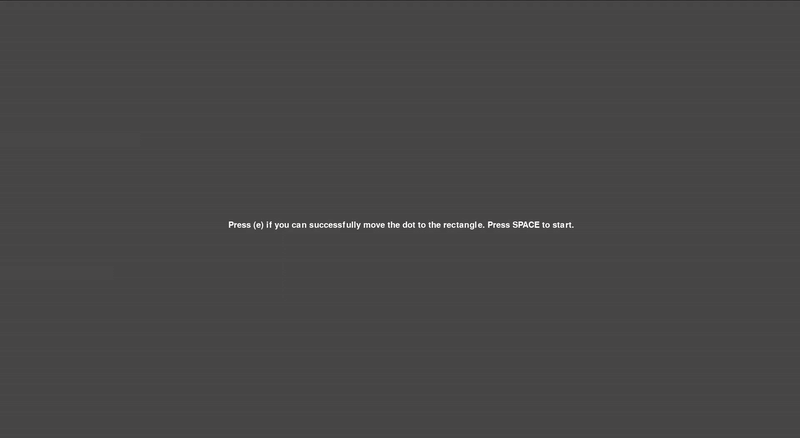

# Lightweight-Webcam-Eye-Tracking
A **webcam-only** eye-tracking system that works on **any screen size**.  
It has been tested on large displays where traditional IR eye trackers often struggle or are impractical.
The system extracts 478×3 Face Mesh landmarks and learns lightweight ML regressors to predict on-screen gaze coordinates in real time. Includes fast calibration, testing UI, and tracking.


---

## TL;DR
- **Task**: Map facial mesh features → 2D screen coordinates (gaze point) on any display
- **Method:** Webcam + Face Mesh → SGD / Ridge / MLP / SVR / XGBoost regressors for (x, y)
- **Motivation:** Avoid specialized hardware; robust at larger viewing distances where classic IR trackers may not function well
- **UI:** Calibration, Test (with success tally), Track

## 📌 Overview
This project uses dense face/iris landmarks and direct regression to screen coordinates, paired with smooth-moving calibration that’s quick and tolerant to head motion. It supports any screen size.
Just set the resolution you want with `pygame.display.set_mode(...)`. The approach is especially practical for large displays and kiosk-like setups.

**Key Features**
- Webcam-only pipeline with Face Mesh (refined landmarks)
- Fast calibration modes (smooth path, edges, random)
- Lightweight ML regressors (SGD, Ridge, MLP, SVR, XGB) selectable at runtime
- Guard-box: auto-pauses when you leave the allowed head region; resumes on return
- Optional region map heatmap of collected samples

## 🧠 Method
- **Landmarks & Features:** Camera frames → Face Mesh → 478 × (x,y,z) flattened vector
- **Screen Prediction:** Two regressors: fₓ(features) → x and fᵧ(features) → y
- **Calibration:** Moving target / edge / random sequences; each frame logs `[features..., target_x, target_y]` to CSV
- **Testing:** Randomly placed green rectangle; move the dot inside and hit E to record success
- **Tracking:** Continuous prediction with temporal averaging for smoother motion

## 📦 Project Structure
```graphql
eye-tracking/
├─ main.py                 # Calibrate / Test / Track UI (pygame)
├─ Gaze.py                 # Face Mesh capture + guard-box (OpenCV)
├─ Target.py               # Target (dot) + Test rectangle rendering (pygame)
├─ utils.py                # Config, region map, helpers
├─ create_models.py        # (Optional) offline training example
├─ config.ini              # Your settings (see below)
├─ data/                   # region_map.npy (auto)
├─ data_csvs/              # calibration CSVs (auto)
├─ test_results/           # per-model test logs (auto)
└─ assets                  # demo files
```

## ⚙️ Setup
### 1. Clone the repo
```bash
git clone https://github.com/Anomaly33/Lightweight-Webcam-Eye-Tracking.git
cd Lightweight-Webcam-Eye-Tracking
```
### 2. Create Environment
```bash
python -m venv .venv
source .venv/bin/activate    # Linux/Mac
# On Windows: .venv\Scripts\activate
```
### 3. Install dependencies
```bash
pip install -r requirements.txt
```
### 4. Config(`config.ini`)
Controls the calibration setup. Increasing `target_speed` speeds up calibration but reduces the number of samples collected.  
`record_frame_rate` defines how many frames are captured each second. Adjust it based on your webcam’s specs.
```ini
[DEFAULT]
image_size = 64
target_speed = 600
target_radius = 20
map_scale = 10
avg_window_length = 8
record_frame_rate = 30
number_of_test_points = 10
points_to_collect = 250

[COLOURS]
white = (255,255,255,255)
black = (0,0,0,255)
gray = (120,120,120,255)
red = (255,0,0,255)
green = (0,255,0,255)
blue = (0,128,255,255)
```
## 🖥️ Screen Size & Modes
Set your desired size/flags in `main.py`
```python
screen = pygame.display.set_mode((1920, 1080), pygame.NOFRAME)
```
Examples:
- Windowed fixed size: `pygame.display.set_mode((2560, 1440))`
- Full-screen desktop res: `pygame.display.set_mode((0, 0), pygame.FULLSCREEN)`
- Resizable window: `pygame.display.set_mode((1920, 1080), pygame.RESIZABLE)`

## 🚀 Run
```bash
python main.py
```
### Controls — Selection Screen
- **1** → Calibrate
- **2** → Test
- **3** → Track
- **S** → Toggle stats overlay
- **ESC** → Quit

### Calibrate
- **SPACE** → Random moving dot
- **M** → Edge moving dot
- **P** → Area points
- **R** → Random points
- After finishing, a “**Done**” screen appears and the app **auto-returns** to the menu after ~3 seconds

### Test
- From the menu press 2, then choose a model:
  - 1 = SGD, 2 = Ridge, 3 = MLP, 4 = SVR, 5 = XGB
- Press SPACE to start the test sequence.
- A green rectangle appears at random positions every ~3 s.
- Move the dot into the rectangle and press `e` to record a success.
- At the end, accuracy is displayed and saved under
